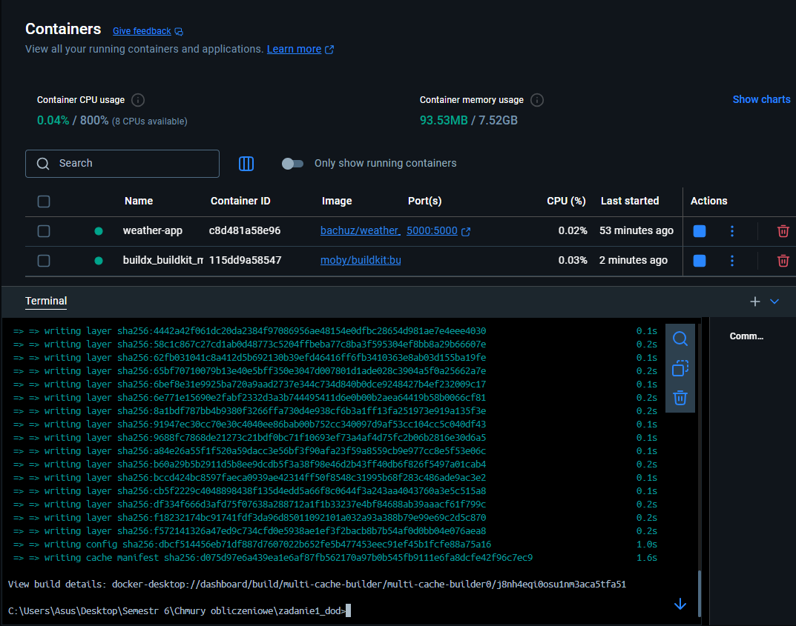
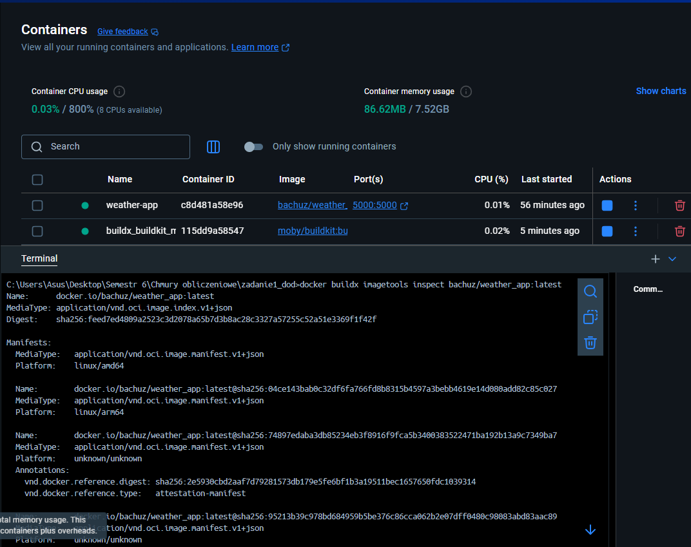
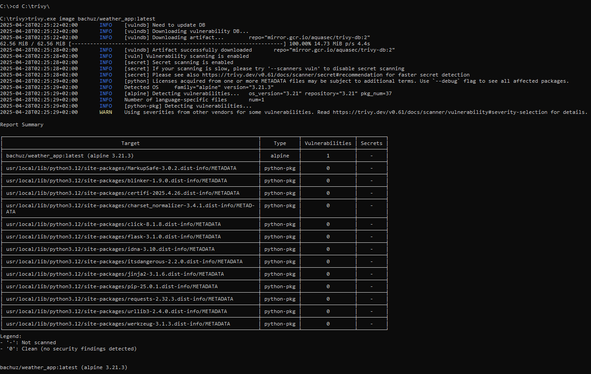

# Zadanie 1 - Część Dodatkowa (+80%)

Autor: Sebastian Żurawski

---

## Repozytorium GitHub:
https://github.com/bachuz13/zadanie1_dod

## Obraz na DockerHub:
https://hub.docker.com/r/bachuz/weather_app

---

# 1. Opis rozwiązania

Rozszerzona wersja zadania obowiązkowego:  
- Zbudowany obraz multiarch (dla platform linux/amd64 oraz linux/arm64),
- Wykorzystano budowanie z cache (eksportowany na DockerHub),
- W procesie budowy użyto funkcji `--mount=secret` dla bezpieczeństwa tokenu GitHub,
- Przeprowadzono analizę bezpieczeństwa obrazu (`Trivy`).

---

# 2. Kroki realizacji

---

## 2.1 Utworzenie buildera Buildx

```bash
docker buildx create --name multi-cache-builder --use
docker buildx inspect multi-cache-builder --bootstrap
```
Builder został utworzony oraz aktywowany z obsługą platform linux/amd64 i linux/arm64.

### Rys. 1. Utworzenie buildera buildx

![Utworzenie buildera buildx]](rys1.png)

## 2.2 Budowanie obrazu multiarch + cache + push na DockerHub

```bash
set GITHUB_TOKEN=ghp_twójTokenTutaj

docker buildx build --platform linux/amd64,linux/arm64 --build-arg GIT_TOKEN=%GITHUB_TOKEN% --secret id=git_token,env=GITHUB_TOKEN --build-arg REPO_URL=https://github.com/bachuz13/zadanie1_dod.git --build-arg BRANCH=main --cache-from=type=registry,ref=bachuz/weather_app:cache --cache-to=type=registry,ref=bachuz/weather_app:cache,mode=max -t bachuz/weather_app:latest --push .
```

Obraz został zbudowany z wykorzystaniem cache i opublikowany na DockerHub.

### Rys. 2. Budowanie i publikacja obrazu multiarch



## 2.3 Inspekcja obrazu - sprawdzenie manifestu

```bash
docker buildx imagetools inspect bachuz/weather_app:latest
```
W wyniku inspekcji potwierdzono dostępność platform:

- linux/amd64
- linux/arm64

### Rys. 3. Inspekcja manifestu multiarch



## 2.4 Analiza bezpieczeństwa obrazu (Trivy)

```bash
trivy image bachuz/weather_app:latest
```
W wyniku analizy obrazu:

- Brak podatności o statusie CRITICAL oraz HIGH.

Wynik:

- Liczba podatności CRITICAL: 0

- Liczba podatności HIGH: 0

- Liczba podatności MEDIUM: 1 (CVE-2025-29087 w sqlite-libs)

Opis:

- Znaleziona podatność (CVE-2025-29087) jest o statusie MEDIUM.

- W zadaniu wymagano braku podatności o poziomie CRITICAL oraz HIGH – wymaganie zostało spełnione.

- Podatność w bibliotece sqlite-libs zostanie naprawiona w kolejnej wersji obrazu bazowego Alpine (3.48.0-r1).

### Rys. 4. Wynik analizy bezpieczeństwa Trivy




